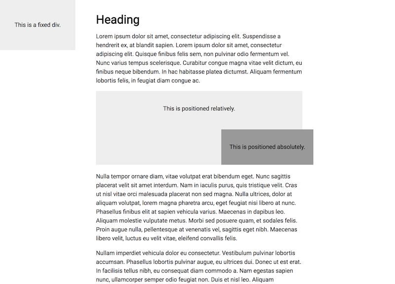

# Positioning Layout

You will be recreating a layout with a partner using CSS positioning rules.

  

## Instructions

- Use the files to recreate the layout shown on the screen.

- This will not be easy, but try your best! Ask the instructor and TAs for help if you get stuck.

- If you finish early Slack the TAs or raise your hand to call their attention. TAs will reassign you to help others in the class.

## Hints

- Use a text generator such as [Lorem Ipsum](https://www.lipsum.com/) to generate paragraph text. You will need to make this page scroll to see how the fixed position element behaves.

- Use the code from the last few activities to help get you started.
